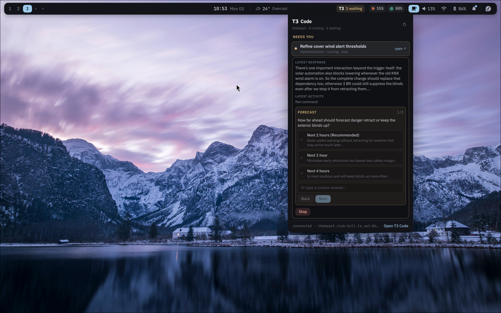

# Fedora Config

An opinionated Fedora Linux installation for my Dell XPS.

This repository uses Ansible to turn a clean Fedora Workstation installation
into a complete daily-driver setup. It installs and configures the desktop,
applications, development tools, shell, dotfiles, laptop services, firewall,
and update workflow. Fedora remains responsible for the kernel, drivers,
SELinux, and the base operating system.



## What it sets up

- Hyprland with a custom Quickshell bar, launcher, notifications, and popovers
- GDM with GNOME kept installed as a fallback session
- A curated set of desktop apps, command-line tools, fonts, and developer tools
- Fish, Kitty, Neovim, containers, Android tooling, and Rust/Node.js toolchains
- Laptop power management, firewall rules, hardware support, and a Plymouth theme
- Repeatable system and Flatpak updates through one command

## Third-party fonts

The Quickshell menubar and its popovers use
[OPPO Sans 4.0](https://www.coloros.com/article/A00000074/). The playbook
downloads OPPO's unmodified official archive, verifies its checksum, and keeps
the bundled OPPO Sans Fonts License Agreement beside the installed font.

## XPS 2026 hardware support

The hardware-gated `xps-2026` role supports Dell XPS 14/16 2026 SKUs `0DB9`
and `0DBA`: internal-speaker PipeWire tuning, the OVTI08F4/IPU7 camera path,
configurable Synaptics haptics, hardware-gated Fedora fingerprint support,
explicit Panther Lake media/firmware RPMs, and Netherlands wireless-regulatory
verification. The camera's missing PSYS/CVS
companions use signed DKMS modules; IPU7 base/ISYS and the entire kernel remain
Fedora stock. Omarchy's custom Panther Lake kernel and display patches are
intentionally not included.

See [Dell XPS 2026 / Panther Lake hardware support](docs/xps-2026-hardware.md)
for Secure Boot enrollment, source pins, diagnostics, and the remaining
Panel Replay/VRR gap.

## Before you install

> [!WARNING]
> This is a personal configuration, not a general-purpose Fedora installer. It
> makes system-wide changes and currently expects **Fedora 44 x86_64**, a
> matching **Dell XPS**, and the local user **`john`**. It also enables the
> security trade-offs configured in
> [`inventory/group_vars/all.yml`](inventory/group_vars/all.yml), including
> passwordless sudo and local Polkit access. Review that file and adapt the
> machine, user, feature, and security settings before running it elsewhere.

Start with a working Fedora 44 installation and a user that can run `sudo`.

## Install

Clone the repository:

```bash
sudo dnf install -y git
git clone https://github.com/DigitalPals/fedora-config.git
cd fedora-config
```

Review the machine-specific settings, then run the installer:

```bash
$EDITOR inventory/group_vars/all.yml
./bootstrap
```

`bootstrap` installs `ansible-core` when needed and applies the complete
configuration. It is safe to run again after changing the configuration.

When `gdm_autologin` is enabled in `inventory/group_vars/all.yml`, the next boot
automatically logs in to **Hyprland (Quickshell)**. From that session, check the
installation with:

```bash
./verify --require-hyprland
```

If `gdm_autologin` is disabled, GDM keeps presenting its normal login screen;
choose **Hyprland (Quickshell)** there to start the configured session.

## Update

Pull the latest configuration and run the updater:

```bash
cd /path/to/fedora-config
git pull --ff-only
./update
```

This updates Fedora packages and system Flatpaks. Use `./update --full` to also
reapply the Ansible configuration. Detailed logs are saved under
`~/.local/state/xps-update/logs/`. Run `./update --help` for all options.

## Commands

| Command | Purpose |
| --- | --- |
| `./bootstrap` | Install Ansible if needed and apply the full configuration |
| `./update` | Update Fedora packages and system Flatpaks |
| `./update --full` | Also update tools and reapply the managed configuration |
| `./verify` | Run non-destructive checks against the installed system |

Extra arguments to `bootstrap` are passed to `ansible-playbook`. For `update`,
use `--full` before Ansible arguments, for example `./update --full --check
--diff` or `./update --full --tags desktop,dotfiles`.

## Documentation

| Document | Purpose |
| --- | --- |
| [docs/quickshell-notes.md](docs/quickshell-notes.md) | Working on the Quickshell shell: how to test it headlessly, the traps, and what has already been decided against |
| [docs/shell-settings-manual-verification.md](docs/shell-settings-manual-verification.md) | Hand-test checklist for the settings window |
| [docs/t3-composer-manual-verification.md](docs/t3-composer-manual-verification.md) | Hand-test checklist for the T3 composer |
| [docs/t3-git-actions-manual-verification.md](docs/t3-git-actions-manual-verification.md) | Hand-test checklist for the T3 git actions |
| [docs/xps-2026-hardware.md](docs/xps-2026-hardware.md) | XPS 2026 speaker, camera, fingerprint, haptics, Secure Boot, and diagnostics |

The automated side is `./verify`, which runs `tests/run` (Node unit tests plus
a qmllint sweep) before the system checks.
